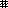

# Kicooya UserFace API Document

[English](api.md)

UseFace Lua Script (face.json の `face.lua.path`) が Kicooya 起動時に読み込まれます。

UseFace Lua Script では `kicooya.face.userFace` を継承したインスタンスを返す必要があります。

本ドキュメントで仕様として公開していない Kicooya 関連のクラス、関数については、現時点で `kicooya.face.userFace` から利用されることを想定していません。

- [`class kicooya.face.userFace`](#class-kicooyafaceuserface)
- [`class kicooya.audioAnalyzer`](#class-kicooyaaudioanalyzer)
- [`class kicooya.musicDB.song`](#class-kicooyamusicdbsong)
- [`class kicooya.font`](#class-kicooyafont)
- [`class kicooya.filePlayer`](#class-kicooyafileplayer)

## `class kicooya.face.userFace`

Kicooya のメディア再生画面（UserFace）を独自に作成するためのクラスです。

### `function kicooya.face.userFace:init()`

コンストラクタ。

### `function kicooya.face.userFace:initializeFace(arg)`

kicooya 起動時に一度だけ呼び出されます。

- arguments

  - `arg` \[`string`\] face.json の `face.lua.arg` で指定した引数

### `function kcy.face.userFace:onActivate(active)`

再生画面のアクティブ状態が変更されたタイミングで呼び出されます。

- arguments

  - `active` \[`boolean`\] 再生画面がアクティブかどうか。

### `function kcy.face.userFace:onPlayingChanged()`

曲の再生中状態が変わったタイミングで呼び出されます。

### `function kicooya.face.userFace:updateNowPlaying(song)`

再生中の曲が変わったタイミングで呼び出されます。

- arguments

  - `song` \[`kicooya.musicDB.song`\] 再生中の曲情報

### `function kicooya.face.userFace:updateBackground()`

再生中の曲が変わったタイミングで呼び出されるので必要な背景を描画してください。

### `function kicooya.face.userFace:drawFace()`

描画タイミングで毎回呼び出されるので動きが必要なものを描画してください。

### `function kicooya.face.userFace:drawAudioVisualizer(analyzer)`

AudioVisualizer を描画するときに呼び出されます。この関数が定義されていると、描画用に音声データを解析する処理が行われます。AudioVisualizer を描画する必要が無い場合、この関数を定義しないでください。

- arguments

  - `analyzer` \[`kicooya.audioAnalyzer`\] 再生中の音声データ解析情報

## `class kicooya.audioAnalyzer`

再生中の音声データ解析情報を取得するためのクラスです。

### `function kicooya.audioAnalyzer.getAudioFrequencyDataCount()`

再生中音声の 周波数/音圧 (dB SPL) データ数を返します。

- return values

  - \[`integer`\] 周波数/音圧のデータ数

### `function kicooya.audioAnalyzer.getAudioFrequencyData(index)`

再生中音声の 周波数/音圧 (dB SPL) を返します。

- arguments

  - `index` \[`integer`\] 取得するデータの index

- return values

  - \[`integer`\] 周波数
  - \[`integer`\] 左の音圧 (dB SPL)
  - \[`integer`\] 右の音圧 (dB SPL)

### `kicooya.audioAnalyzer.getAudioBufferCount()`

再生中音声のデータ数を返します。

- return values

  - \[`integer`\] データ数

### `kicooya.audioAnalyzer.getAudioBuffer(index)`

再生中音声のデータを返します。

- arguments

  - `index` \[`integer`\] 取得するデータの index

- return values

  - \[`float`\] 左音声データ
  - \[`float`\] 右音声データ

## `class kicooya.musicDB.song`

曲の情報を取得するためのクラスです。

<!--
### kicooya.musicDB.song:init(path, songRaw)
-->

### `kicooya.musicDB.song:getFilePath()`

ファイルパスを返します。

- return values

  - \[`string`\] ファイルパス

### `kicooya.musicDB.song:getLargeArtImage()`

アートワーク（大）を返します。

- return values

  - \[`playdate.graphics.image`\] アートワーク（大）

### `kicooya.musicDB.song:getSmallArtImage()`

アートワーク（小）を返します。

- return values

  - \[`playdate.graphics.image`\] アートワーク（小）

<!--
### `kicooya.musicDB.song:hasCachedArtImage`
-->

### `kicooya.musicDB.song:getFileSize()`

ファイルサイズを返します。

- return values

  - \[`integer`\] ファイルサイズ

### `kicooya.musicDB.song:getFileSizeReadable()`

読みやすく整形されたファイルサイズを返します。

- return values

  - \[`string`\] 読みやすく整形されたファイルサイズ

### `kicooya.musicDB.song:getLastModified()`

ファイルの最終更新日時を返します。

- return values

  - \[`table`\]  `playdate.file.modtime` と同じテーブルです。`playdate.file.modtime` のドキュメントを参照してください。

### `kicooya.musicDB.song:getLastModifiedString()`

読みやすくす整形されたファイルの最終更新日時を返します。

- return values

  - \[`string`\]  読みやすくす整形されたファイルの最終更新日時

### `kicooya.musicDB.song:getTitle()`

タイトルを返します。

- return values

  - \[`string`\] タイトル

### `kicooya.musicDB.song:getArtist()`

アーティストを返します。

- return values

  - \[`string`\] アーティスト

### `kicooya.musicDB.song:getAlbum()`

アルバムを返します。

- return values

  - \[`string`\] アルバム

### `kicooya.musicDB.song:getAlbumArtist()`

アルバムアーティストを返します。

- return values

  - \[`string`\] アルバムアーティスト

### `kicooya.musicDB.song:getGenre()`

ジャンルを返します。

- return values

  - \[`string`\] ジャンル

### `kicooya.musicDB.song:getComposer()`

作曲者を返します。

- return values

  - \[`string`\] 作曲者

### `kicooya.musicDB.song:getEncodedBy()`

コンテンツをエンコードした人物またはグループを返します。

- return values

  - \[`string`\] コンテンツをエンコードした人物またはグループ

### `kicooya.musicDB.song:getTrack()`

トラック情報を TRCK/TRK(ID3Tag) の文字列のまま返します。

- return values

  - \[`string`\] トラック情報

### `kicooya.musicDB.song:getTrackNumber()`

トラック番号を返します。

- return values

  - \[`integer`\] トラック番号

### `kicooya.musicDB.song:getNumberOfTracks()`

トラック数を返します。

- return values

  - \[`integer`\] トラック数

### `kicooya.musicDB.song:getDisc()`

ディスク情報を TPOS/TPA(ID3Tag) の文字列のまま返します。

- return values

  - \[`string`\] ディスク情報

### `kicooya.musicDB.song:getDiscNumber()`

ディスク番号を返します。

- return values

  - \[`integer`\] ディスク番号

### `kicooya.musicDB.song:getNumberOfDiscs()`

ディスク数を返します。

- return values

  - \[`integer`\] ディスク数

### `kicooya.musicDB.song:getYear()`

年を返します。

- return values

  - \[`integer`\] 年

### `kicooya.musicDB.song:getBitrate()`

ビットレートを返します。

- return values

  - \[`integer`\] ビットレート

### `kicooya.musicDB.song:getSamplingRate()`

サンプリングレートを返します。

- return values

  - \[`integer`\] サンプリングレート

### `kicooya.musicDB.song:getChannelCount()`

チャンネル数を返します。

- return values

  - \[`integer`\] チャンネル数

### `kicooya.musicDB.song:getFileFormat()`

ファイルフォーマットを返します。
※ 現時点で再生できるフォーマットが MP3 のみなので、MP3(mono) / MP3(stereo) のいずれかを返します。

- return values

  - \[`string`\] ファイルフォーマット

## `class kicooya.font`

Kicooya が保持している `playdate.graphics.font` を取得するためのクラスです。

### `function kicooya.font:getFont(id)`

フォント識別子で指定されたフォントを返します。

- arguments

  - `id` \[`string`\] フォント識別子

- return values

  - \[`playdate.graphics.font`\] フォント

|フォント識別子|Font Path|
|-|-|
|AshevilleSans24Light|assets/fonts/Asheville/Asheville Sans 24 Light/Asheville-Sans-24-Light|
|AshevilleSans14Light|assets/fonts/Asheville/Asheville Sans 14 Light/Asheville-Sans-14-Light|
|AshevilleSans14Bold|assets/fonts/Asheville/Asheville Sans 14 Bold/Asheville-Sans-14-Bold|
|FullCircle|assets/fonts/Full Circle/font-full-circle|
|CuberickBold|assets/fonts/Cuberick/font-Cuberick-Bold|
|NontendoLight|assets/fonts/Nontendo/Nontendo-Light|
|NontendoBold|assets/fonts/Nontendo/Nontendo-Bold|
|OklahomaBold|assets/fonts/Oklahoma/Oklahoma-Bold|
|Shinonome14B|assets/fonts/Shinonome/Shinonome14B|
|Shinonome16B|assets/fonts/Shinonome/Shinonome16B|
|Roobert10Bold|assets/fonts/Roobert/Roobert-10-Bold|
|Roobert11Medium|assets/fonts/Roobert/Roobert-11-Medium|
|Roobert20Medium|assets/fonts/Roobert/Roobert-20-Medium|

<!--
### function kicooya.font:getSimpleCellFont()
### function kicooya.font:getSimpleCellValueFont()
### function kicooya.font:getMenuFont()
-->

### `function kicooya.font:getTitleFont()``

タイトル描画用のフォントを `OPTION -> FONTS` の設定に従って返します。

- return values

  - \[`playdate.graphics.font`\] フォント

### `function kicooya.font:getDescriptionFont()`

説明描画用のフォントを `OPTION -> FONTS` の設定に従って返します。

- return values

  - \[`playdate.graphics.font`\] フォント

<!--
### `function kicooya.font:getPlayerFontType()`
### `function kicooya.font:setPlayerFontType()`
-->

## `class kicooya.filePlayer`

ファイルプレーヤーを操作するためのクラスです。

<!--
function kicooya.filePlayer:initializePlayer()
function kicooya.filePlayer:didUnderrun()
kicooya.filePlayer:setFile(path)
-->

### `function kicooya.filePlayer:play()`

ファイルの再生を開始します。

### `function kicooya.filePlayer:stop()`

再生中のファイルを停止します。

### `function kicooya.filePlayer:pause()`

再生中のファイルを一時停止します。

### `function kicooya.filePlayer:isPlaying()`

ファイルが再生中かどうかを返します。

- return values

  - \[`boolean`\] ファイルを再生中かどうか。

### `function kicooya.filePlayer:getLength()`

曲の長さを返します。

- return values

  - \[`float`\] 曲の長さ（秒）

### `function kicooya.filePlayer:getOffset()`

ファイルプレーヤーの再生位置を返します。

- return values

  - \[`float`\] 再生位置（秒）

### `function kicooya.filePlayer:setOffset(second)`

再生位置を設定します。

- arguments

  - `second` \[`float`\] 再生位置（秒）

### `kicooya.filePlayer.repeatMode`

リピートモード定数。

- `kicooya.filePlayer.repeatMode.repeatOff` リピートオフ
- `kicooya.filePlayer.repeatMode.repeatOn` リピートオン
- `kicooya.filePlayer.repeatMode.repeat1` 1ファイルリピート

### `function kicooya.filePlayer:setRepeatMode(mode)`

リピートモードを設定します。

- arguments

  - `mode` \[[`kicooya.filePlayer.repeatMode`](#kicooyafileplayerrepeatmode)\] リピートモード

### `function kicooya.filePlayer:getRepeatMode()`

リピートモードを返します。

- return values

  - \[[`kicooya.filePlayer.repeatMode`](#kicooyafileplayerrepeatmode)\] リピートモード

### `function kicooya.filePlayer:getNowPlayingSong()`

再生中の曲を返します。

- return values

  - \[[`kicooya.musicDB.song`](#class-kicooyamusicdbsong)\] 再生中の曲

<!--
function kicooya.filePlayer:getNowPlayingVideoFrameImage()
function kicooya.filePlayer:getNowPlayingVideoItem()
function kicooya.filePlayer:pushNowPlayingChangedCallback(callback)
function kicooya.filePlayer:popNowPlayingChangedCallback()
function kicooya.filePlayer:pushOnSetOffsetCallback(callback)
function kicooya.filePlayer:popOnSetOffsetCallback()
-->

## `class kicooya.pattern`

パターンを取得するためのクラスです。
Kicooya が保持しているパターンを取得するためのクラスです。

|プロパティ名|パターン画像|
|-|-|
|kicooya.pattern.backslash||
|kicooya.pattern.bigchecker||
|kicooya.pattern.birds||
|kicooya.pattern.black||
|kicooya.pattern.boxchecker||
|kicooya.pattern.cross||
|kicooya.pattern.crosshatch||
|kicooya.pattern.dbandcheck||
|kicooya.pattern.densechecker||
|kicooya.pattern.denseslash||
|kicooya.pattern.double||
|kicooya.pattern.forwardslash||
|kicooya.pattern.invertboxchecker||
|kicooya.pattern.longcheckerhor||
|kicooya.pattern.longcheckervert||
|kicooya.pattern.pinwheel||
|kicooya.pattern.sparsechecker||
|kicooya.pattern.spot||
|kicooya.pattern.swave||
|kicooya.pattern.swirl||
|kicooya.pattern.target||
|kicooya.pattern.wave||
|kicooya.pattern.weave_a||
|kicooya.pattern.weave_b||
|kicooya.pattern.weave_c||
|kicooya.pattern.weave_d||
|kicooya.pattern.weave_e||
|kicooya.pattern.white||
|kicooya.pattern.wisp||
|kicooya.pattern.zag||
|kicooya.pattern.zig||
