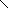
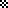
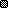
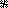
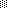
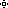
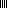
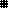

# face.json Document

[English](json.md)

Kicooya UserFace では、face.json で再生画面を作成することができます。

face.json のみで UserFace を作成できますが、より詳細な描画を行いたい場合は [Kicooya UserFace API](./api.md) を利用してください。

## face.json 構成

```text
+- face
    |
    +- title
    |
    +- author
    |
    +- debug
    |
    +- lua
    |
    +- fonts
    |   |
    |   +- [font ...]
    |
    +- patterns
    |   |
    |   +- [pattern ...]
    |
    +- textStyles
    |   |
    |   +- [textStyle ...]
    |
    +- background
    |   |
    |   +- texts
    |   |   |
    |   |   +- [text ...]
    |   |
    |   +- images
    |       |
    |       +- [image ...]
    |
    +- foreground
        |
        +- texts
        |   |
        |   +- [text ...]
        |
        +- images
        |   |
        |   +- [image ...]
        |
        +- playerButtons
        |
        +- seekBar
        |
        +- audioSpectrum
```

## face.json Data type

### face オブジェクト

face のルートオブジェクトです。

|プロパティ名|型|説明|
|-|-|-|
|title|文字列|Face のタイトル。|
|author|文字列|Face の作者名。|
|debug|真偽値|デバッグモード。true: テキストの描画領域の矩形が描画されます。|
|lua|[lua オブジェクト](#lua-オブジェクト)|ユーザー定義 の Lua Script で Face を描画します。|
|fonts|[fonts オブジェクト](#fonts-オブジェクト)|テキスト描画で利用するフォントを読み込みます。|
|patterns|[patterns オブジェクト](#patterns-オブジェクト)|塗りつぶし用のパターンを画像から読み込みます。|
|textStyles|[textStyles オブジェクト](#textstyles-オブジェクト)|テキストの描画スタイルを定義します。|
|background|[background オブジェクト](#background-オブジェクト)|再生中の曲が変わったタイミングで一度だけ描画されます。|
|foreground|[foreground オブジェクト](#foreground-オブジェクト)|曲の再生中、フレーム毎に描画されます。|
<!--|preinstall|真偽値|プリインストールかどうか。UserFace では利用しません。|-->

### lua オブジェクト

ユーザー定義 の Lua Script で Face を描画します。

|プロパティ名|型|説明|
|-|-|-|
|path|文字列|Lua Script のファイルパス（拡張子無し）。|
|arg|文字列|引数。Lua Script の初期化時（`initializeFace`）に引数として設定されます。|
|zOrder|[zOrder オブジェクト](#zOrder-オブジェクト)|描画の重なり順序を指定します。|

#### zOrder オブジェクト

ユーザー定義 の Lua Script による描画の重なり順序を指定します。

|プロパティ名|型|説明|
|-|-|-|
|background|数値|background の重なり順序を指定します。値が大きいものが、より上に描画されます。|
|foreground|数値|foreground の重なり順序を指定します。値が大きいものが、より上に描画されます。|
|audioVisualizer|数値|audioVisualizer の重なり順序を指定します。値が大きいものが、より上に描画されます。audioVisualizer は foreground の重なり順序に含まれ、描画されます。|

### fonts オブジェクト

テキスト描画で利用するフォントを読み込みます。

|プロパティ名|型|説明|
|-|-|-|
|id|文字列|フォント識別子。|
|path|文字列|フォントのファイルパス。|

### patterns オブジェクト

塗りつぶし用のパターンを画像から読み込みます。

|プロパティ名|型|説明|
|-|-|-|
|path|文字列|パターン画像のファイルパス（拡張子無し）。ファイル名がパターン識別子として利用されます。|

### textStyles オブジェクト

テキストの描画スタイルを定義します。

|プロパティ名|型|説明|
|-|-|-|
|id|文字列|テキストスタイル識別子。|
|font|文字列|フォント識別子 ([fonts オブジェクト](#fonts-オブジェクト) / [Kicooya 組み込みのフォント](#fonts))|
|drawMode|列挙型| 描画モード。<br>copy<br>whiteTransparent<br>blackTransparent<br>fillWhite<br>fillBlack<br>xor<br>nxor<br>inverted<br>※ 詳細は `playdate.graphics.setImageDrawMode` のドキュメントを参照してください。|
|hAlign|列挙型|水平位置。<br>left : 左揃え<br>center : 中央揃え<br>right : 右揃え|
|vAlign|列挙型|垂直位置。<br>top : 上揃え<br>middle : 中央揃え<br>bottom : 下揃え|

### background オブジェクト

再生中の曲が変わったタイミングで一度だけ描画されます。

|プロパティ名|型|説明|
|-|-|-|
|texts|[texts オブジェクト](#texts-オブジェクト)|テキストを描画します。|
|images|[images オブジェクト](#images-オブジェクト)|画像を描画します。|

### foreground オブジェクト

曲の再生中、フレーム毎に描画されます。

|プロパティ名|型|説明|
|-|-|-|
|texts|[texts オブジェクト](#texts-オブジェクト)|テキストを描画します。|
|images|[images オブジェクト](#images-オブジェクト)|画像を描画します。|
|playerButtons|[playerButtons オブジェクト](#playerbuttons-オブジェクト)|プレーヤー操作用のボタンを画像から読み込みます。|
|seekBar|[seekBar オブジェクト](#seekbar-オブジェクト)|シークバーを描画します。|
|audioSpectrum|[audioSpectrum オブジェクト](#audiospectrum-オブジェクト)|オーディオスペクトラムを描画します。|

※ Lua Script 関数: drawAudioVisualizer() は foreground オブジェクトと同じタイミングで呼び出されます。


### texts オブジェクト

テキストを描画します。

|プロパティ名|型|説明|
|-|-|-|
|style|文字列|[テキストスタイル識別子](#textstyles-オブジェクト)。|
|rect|矩形|テキストを描画する矩形。|
|text|文字列|描画するテキストの内容。<br>[プレースホルダ](#プレースホルダ) を利用して、再生中のメディアなどの情報を描画できます。|
|zOrder|数値|描画の重なり順序を指定します。値が大きいものが、より上に描画されます。|

### images オブジェクト

画像を描画します。
pos、rect のどちらかを指定して、描画位置を決定します。

|プロパティ名|型|説明|
|-|-|-|
|path|ファイルパス or<br>列挙型|パターン画像のファイルパス、または 再生中メディアのアートイメージを指定します。<br>song.artImageSmall : アートイメージ小 (最大 80 x 80)<br>song.artImageLarge : アートイメージ大 (最大 180 x 180)<br>|
|pos|点|画像を表示する左上の点。|
|rect|矩形|画像を描画する矩形。画像は矩形の中央に描画されます。|
|border|[border オブジェクト](#border-オブジェクト)|画像のボーダー。|
|zOrder|数値|描画の重なり順序を指定します。値が大きいものが、より上に描画されます。|

### playerButtons オブジェクト

プレーヤー操作用のボタンを画像で定義します。

|プロパティ名|型|説明|
|-|-|-|
|path|文字列|[プレーヤー操作用ボタン画像](#ボタン画像)のファイルパス|
|pos|点|ボタンを表示する左端の点。 |
|zOrder|数値|描画の重なり順序を指定します。値が大きいものが、より上に描画されます。|

#### プレーヤー操作用ボタン画像

7x2 のマトリクス画像テーブルでボタンを定義してください。
マトリクス画像テーブルについては Playdate のドキュメント Image table > Matrix image tables を参照してください。


上段: 非選択状態の画像

下段: 選択状態の画像

1. 再生
1. 停止
1. リピート OFF
1. リピート ON
1. リピート 1
1. シャッフル OFF
1. シャッフル ON

### seekBar オブジェクト

シークバーを描画します。

|プロパティ名|型|説明|
|-|-|-|
|rect|矩形|シークバーを描画する矩形。|
|radius|数値|角丸の半径。|
|foreground|文字列|シークバーを塗りつぶす為のパターン識別子([patterns オブジェクト](#patterns-オブジェクト) / [組み込み Patterns](#patterns))。|
|background|文字列|背景を塗りつぶす為のパターン識別子([patterns オブジェクト](#patterns-オブジェクト) / [組み込み Patterns](#patterns))。|
|border|[border オブジェクト](#border-オブジェクト)|seekBar のボーダー。|
|zOrder|数値|描画の重なり順序を指定します。値が大きいものが、より上に描画されます。|

### audioSpectrum オブジェクト

オーディオスペクトラムを描画します。
audioSpectrum.type の値毎に、指定できるプロパティが異なります。

|プロパティ名|型|説明|
|-|-|-|
|type|列挙型|オーディオスペクトラムの種類。<br>stereo : ステレオ<br>mono : モノラル<br>wave : 波形|
|rect|矩形|オーディオスペクトラムを描画する矩形。|
|zOrder|数値|描画の重なり順序を指定します。値が大きいものが、より上に描画されます。|

#### audioSpectrum (type=stereo)

|プロパティ名|型|説明|
|-|-|-|
|foreground|文字列|アイテムを塗りつぶす為のパターン識別子([patterns オブジェクト](#patterns-オブジェクト) / [組み込み Patterns](#patterns))。|
|background|文字列|背景を塗りつぶす為のパターン識別子([patterns オブジェクト](#patterns-オブジェクト) / [組み込み Patterns](#patterns))。|
|peek|文字列|ピークを描画する為のパターン識別子([patterns オブジェクト](#patterns-オブジェクト) / [組み込み Patterns](#patterns))。|
|blockMarginWidth|数値|スペクトラム左右ブロックのマージン幅|
|itemWidth|数値|アイテムの幅|
|itemHeight|数値|アイテムの高さ|
|itemMarginWidth|数値|アイテム間のマージン幅|
|peekHeight|数値|ピークの高さ|

#### audioSpectrum (type=mono)

|プロパティ名|型|説明|
|-|-|-|
|foreground|文字列|オーディオスペクトラムを塗りつぶす為のパターン識別子([patterns オブジェクト](#patterns-オブジェクト) / [組み込み Patterns](#patterns))。|
|background|文字列|背景を塗りつぶす為のパターン識別子([patterns オブジェクト](#patterns-オブジェクト) / [組み込み Patterns](#patterns))。|
|border|[border オブジェクト](#border-オブジェクト)|オーディオスペクトラムのボーダー。|

#### audioSpectrum (type=wave)

|プロパティ名|型|説明|
|-|-|-|
|foreground|文字列|オーディオスペクトラムを塗りつぶす為のパターン識別子([patterns オブジェクト](#patterns-オブジェクト) / [組み込み Patterns](#patterns))。|
|background|文字列|背景を塗りつぶす為のパターン識別子([patterns オブジェクト](#patterns-オブジェクト) / [組み込み Patterns](#patterns))。|
|border|[border オブジェクト](#border-オブジェクト)|オーディオスペクトラムのボーダー。|

### border オブジェクト

ボーダーを描画します。

|プロパティ名|型|説明|
|-|-|-|
|size|整数（1 - 255）|ボーダーのサイズ。|
|pattern|文字列|ボーダーを塗りつぶす為のパターン識別子([patterns オブジェクト](#patterns-オブジェクト) / [組み込み Patterns](#patterns))。|

## プレースホルダ

[texts オブジェクト](#texts-オブジェクト)の text プロパティでは、プレースホルダを利用して、再生中のメディアなどの情報を描画できます。

### 再生中の曲情報

|Key|Description|
|-|-|
|${song.title}|タイトル|
|${song.album}|アルバム|
|${song.artist}|アーティスト|
|${song.composer}|作曲者|
|${song.genre}|ジャンル|
|${song.year}|年|
|${song.track}|トラック|
|${song.trackNumber}|トラック数|
|${song.numberOfTracks}|トラック番号|
|${song.disc}|ディスク|
|${song.discNumber}|ディスク数|
|${song.numberOfDiscs}|ディスク番号|
|${song.fileFormat}|ファイル種別|
|${song.fileSize}|ファイルサイズ|
|${song.fileSizeReadable}|読みやすく整形されたファイルサイズ|
|${song.bitrate}|ビットレート|
|${song.samplingRate}|サンプリングレート|
|${song.encodedBy}|コンテンツをエンコードした人物またはグループ|
|${song.lastModified}|最終更新|

### プレーヤーの情報

|Key|Description|
|-|-|
|${player.currentPlaybackPosition}|現在の再生位置|
|${player.currentPlaybackTimeRemaining}|再生中の曲の残り時間|
|${player.currentPlaybackDuration}|再生中の曲の長さ|

### プレイリストの情報

|Key|Description|
|-|-|
|${playlist.currentIndex}|プレイリストの再生位置|
|${playlist.length}|プレイリストの曲数|

## Kicooya 組み込みリソース識別子

Kicooya のアセットとして組み込まれているリソースの識別子の一覧です。

### Fonts

|Font Unique ID|Font Path|
|-|-|
|AshevilleSans14Light|assets/fonts/Asheville/Asheville Sans 14 Light/Asheville-Sans-14-Light|
|AshevilleSans14Bold|assets/fonts/Asheville/Asheville Sans 14 Bold/Asheville-Sans-14-Bold|
|CuberickBold|assets/fonts/Cuberick/font-Cuberick-Bold|
|FullCircle|assets/fonts/Full Circle/font-full-circle|
|NontendoLight|assets/fonts/Nontendo/Nontendo-Light|
|NontendoBold|assets/fonts/Nontendo/Nontendo-Bold|
|Roobert10Bold|assets/fonts/Roobert/Roobert-10-Bold|
|Roobert11Medium|assets/fonts/Roobert/Roobert-11-Medium|
|Roobert20Medium|assets/fonts/Roobert/Roobert-20-Medium|
|NotoSansJP16Medium|assets/fonts/NotoSansJP/NotoSansJP-Medium16|
|NotoSansJP20Medium|assets/fonts/NotoSansJP/NotoSansJP-Medium20|
|font.title|タイトル描画用のフォントを `OPTION -> FONTS` の設定に従って返す|
|font.description|説明描画用のフォントを `OPTION -> FONTS` の設定に従って返す|

### Patterns

|Pattern Unique ID|Pattern Image|
|-|-|
|backslash||
|bigchecker||
|birds||
|black||
|boxchecker||
|cross||
|crosshatch||
|dbandcheck||
|densechecker||
|denseslash||
|double||
|forwardslash||
|invertboxchecker||
|longcheckerhor||
|longcheckervert||
|pinwheel||
|sparsechecker||
|spot||
|swave||
|swirl||
|target||
|vertical||
|wave||
|weave_a||
|weave_b||
|weave_c||
|weave_d||
|weave_e||
|white||
|wisp||
|zag||
|zig||
