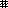
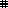

# face.json Document

[日本語](json-jp.md)

Kicooya UserFace allows you to create a playback screen with face.json.

You can create a UserFace using only face.json, but for more detailed rendering use the [Kicooya UserFace API](./api.md).

## face.json structure

```text
+- face
    |
    +- title
    |
    +- author
    |
    +- debug
    |
    +- lua
    |
    +- fonts
    |   |
    |   +- [font ...]
    |
    +- patterns
    |   |
    |   +- [pattern ...]
    |
    +- textStyles
    |   |
    |   +- [textStyle ...]
    |
    +- background
    |   |
    |   +- texts
    |   |   |
    |   |   +- [text ...]
    |   |
    |   +- images
    |       |
    |       +- [image ...]
    |
    +- foreground
        |
        +- texts
        |   |
        |   +- [text ...]
        |
        +- images
        |   |
        |   +- [image ...]
        |
        +- playerButtons
        |
        +- seekBar
        |
        +- audioSpectrum
```

## face.json Data type

### face　object

The root object of face.

|Property name|Type|Description|
|-|-|-|
|title|string|Title of Face.|
|author|string|Autohr of Face.|
|debug|boolean|Debug mode. true: A rectangle of the text drawing area is drawn.|
|lua|[lua object](#lua-object)|Draw face with a user-defined Lua Script.|
|fonts|[fonts object](#fonts-object)|Loads the fonts to be used for text drawing.|
|patterns|[patterns object](#patterns-object)|Load the pattern for the fill from an image.|
|textStyles|[textStyles object](#textstyles-object)|Defines the text drawing style.|
|background|[background object](#background-object)|Background objects are drawn only once at the timing when the currently playing song changes.|
|foreground|[foreground object](#foreground-object)|Foreground objects are drawn frame by frame during song playback.|
<!--|preinstall|boolean|Pre-installed or not. Not used by UserFace.|-->

### lua object

Draw face with a user-defined Lua Script.

|Property name|Type|Description|
|-|-|-|
|path|string|Lua Script file path (without extension).|
|arg|string|Argument. Set as an argument during Lua Script initialization(`initializeFace`).|
|zOrder|[zOrder object](#zOrder-object)|Specifies the stack order of drawings.|

#### zOrder object

Specifies the stack order of drawing by user-defined Lua Script.

|Property name|Type|Description|
|-|-|-|
|background|integer|Specifies the stack order of background drawings. Larger values are drawn higher.|
|foreground|integer|Specifies the stack order of foreground drawings. Larger values are drawn higher.|
|audioVisualizer|integer|Specifies the stack order of audioVisualizer drawings.Larger values are drawn higher. AudioVisualizer is included in the foreground drawing.|

### fonts object

Loads the fonts to be used for text drawing.

|Property name|Type|Description|
|-|-|-|
|id|string|Font UID.|
|path|string|Font file path.|

### patterns object

Load the pattern for the fill from an image.

|Property name|Type|Description|
|-|-|-|
|path|string|Pattern image file path (without extension). The filename is used as the pattern UID. |

### textStyles object

Defines the text drawing style.

|Property name|Type|Description|
|-|-|-|
|id|string|Text style UID.|
|font|string|Font UID ([fonts object](#fonts-object) / [Kicooya built-in fonts](#fonts))|
|drawMode|enumeration| Drawing mode.<br>copy<br>whiteTransparent<br>blackTransparent<br>fillWhite<br>fillBlack<br>xor<br>nxor<br>inverted<br>\* See `playdate.graphics.setImageDrawMode`  in the Playdate documentation for details.|
|hAlign|enumeration|Horizontal position.<br>left / center/ right|
|vAlign|enumeration|Vertical position.<br>top / middle / bottom|

### background object

Background objects are drawn only once at the timing when the currently playing song changes.

|Property name|Type|Description|
|-|-|-|
|texts|[texts object](#texts-object)|Draws a text.|
|images|[images object](#images-object)|Draws an image.|

### foreground object

Foreground objects are drawn frame by frame during song playback.

|Property name|Type|Description|
|-|-|-|
|texts|[texts object](#texts-object)|Draws a text.|
|images|[images object](#images-object)|Draws an image.|
|playerButtons|[playerButtons object](#playerbuttons-object)|Load the buttons for player operation from the image.|
|seekBar|[seekBar object](#seekbar-object)|Draws a seek bar.|
|audioSpectrum|[audioSpectrum object](#audiospectrum-object)|Draws an audio spectrum.|

* Lua Script function: drawAudioVisualizer() is called at the same time as the foreground object.

### texts object

Draws a text.

|Property name|Type|Description|
|-|-|-|
|style|string|[Text style UID](#textstyles-object)。|
|rect|rectangle|Rectangle that bounds the drawing area for the text.|
|text|string|Text to be drawn.<br>The [Placeholder](#Placeholder) can be used to draw information as the currently playing.|
|zOrder|Integer|Specifies the stack order of drawings. Larger values are drawn higher.|

### images object

Draws an image.
Either pos or rect can be specified to determine the drawing position.

|Property name|Type|Description|
|-|-|-|
|path|Filepath or<br>enumeration|Specifies the file path of the pattern image or the art image of the the currently playing.<br>`song.artImageSmall` : Art Image Small (Max 80x80)<br>`song.artImageLarge` : Art Image Large (Max 180x180)|
|pos|point|Point that the upper-left corner of the destination position at which to draw the image.|
|rect|rectangle|Rectangle that bounds the drawing area for the image. The image is drawn in the center of the rectangle.|
|border|[border object](#border-object)|Border of the image.|
|zOrder|Integer|Specifies the stack order of drawings. Larger values are drawn higher.|

### playerButtons object

Load the buttons for player operation from the image.

|Property name|Type|Description|
|-|-|-|
|path|string|File path of [Image for playerButtons](#image-for-playerbuttons).|
|pos|point|Point that the upper-left corner of the destination position at which to display the buttons.|
|zOrder|Integer|Specifies the stack order of drawings. Larger values are drawn higher.|

#### Image for playerButtons

Define the buttons in a 7x2 matrix image table.
\* See the Playdate documentation `Image table > Matrix image tables` for matrix image tables.


Upper row: Unselected image

Lower column: Selected image

1. Play
1. Pause
1. Repeat off
1. Repeat on
1. Repeat one file
1. Shuffle off
1. Shuffle on

### seekBar object

Draws a seek bar.

|Property name|Type|Description|
|-|-|-|
|rect|rectangle|Rectangle that bounds the drawing area for the seek bar.|
|radius|integer|Radius of corners.|
|foreground|string|Pattern UID to fill seek bar ([patterns object](#patterns-object) / [Kicooya built-in patterns](#patterns)).|
|background|string|Pattern UID to fill background ([patterns object](#patterns-object) / [Kicooya built-in patterns](#patterns)).|
|border|[border object](#border-object)|Border of seek bar|
|zOrder|Integer|Specifies the stack order of drawings. Larger values are drawn higher.|

### audioSpectrum object

Draws an audio spectrum.
The properties that can be specified differ for each type.

|Property name|Type|Description|
|-|-|-|
|type|enumeration|Types of Audio Spectrum.<br>stereo / mono / wave|
|rect|rectangle|Rectangle that bounds the drawing area for the audio spectrum.|
|zOrder|Integer|Specifies the stack order of drawings. Larger values are drawn higher.|

#### audioSpectrum (type=stereo)

|Property name|Type|Description|
|-|-|-|
|foreground|string|Pattern UID to fill audio spectrum ([patterns object](#patterns-object) / [Kicooya built-in patterns](#patterns)).|
|background|string|Pattern UID to fill background ([patterns object](#patterns-object) / [Kicooya built-in patterns](#patterns)).|
|peek|string|Pattern UID to draw peek ([patterns object](#patterns-object) / [Kicooya built-in patterns](#patterns)).|
|blockMarginWidth|integer|Margin width of the left and right blocks of the audio spectrum.|
|itemWidth|integer|Item width.|
|itemHeight|integer|Item height.|
|itemMarginWidth|integer|Margin width between items.|
|peekHeight|integer|Peek height.|

#### audioSpectrum (type=mono)

|Property name|Type|Description|
|-|-|-|
|foreground|string|Pattern UID to fill audio spectrum ([patterns object](#patterns-object) / [Kicooya built-in patterns](#patterns)).|
|background|string|Pattern UID to fill background ([patterns object](#patterns-object) / [Kicooya built-in patterns](#patterns)).|
|border|[border object](#border-object)|Border of audio spectrum.|

#### audioSpectrum (type=wave)

|Property name|Type|Description|
|-|-|-|
|foreground|string|Pattern UID to fill audio spectrum ([patterns object](#patterns-object) / [Kicooya built-in patterns](#patterns)).|
|background|string|Pattern UID to fill background ([patterns object](#patterns-object) / [Kicooya built-in patterns](#patterns)).|
|border|[border object](#border-object)|Border of audio spectrum.|

### border object

Draws a border.

|Property name|Type|Description|
|-|-|-|
|size|integer (1 - 255)|Border size.|
|pattern|string|Pattern UID to fill border ([patterns object](#patterns-object) / [Kicooya built-in patterns](#patterns)).|

## Placeholder

The text property of a [texts object](#texts-object) can use a placeholder to draw information such as the currently playing.

### Currently playing song information

|Key|Description|
|-|-|
|${song.title}|Title|
|${song.album}|Album|
|${song.artist}|Artist|
|${song.composer}|Composer|
|${song.genre}|Genre|
|${song.year}|Year|
|${song.track}|Track|
|${song.trackNumber}|Track number|
|${song.numberOfTracks}|Number of tracks|
|${song.disc}|Disc|
|${song.discNumber}|Disc number|
|${song.numberOfDiscs}|Number of discs|
|${song.fileFormat}|File format|
|${song.fileSize}|File size|
|${song.fileSizeReadable}|Human readable file size|
|${song.bitrate}|Bitrate|
|${song.samplingRate}|Sampling rate|
|${song.encodedBy}|Name of person or group that encoded|
|${song.lastModified}|Last Modified|

### Player information

|Key|Description|
|-|-|
|${player.currentPlaybackPosition}|Current playback position|
|${player.currentPlaybackTimeRemaining}|Current playback time remaining|
|${player.currentPlaybackDuration}|Current playback duration|

### Playlist information

|Key|Description|
|-|-|
|${playlist.currentIndex}|Current index of playlist|
|${playlist.length}|Number of songs in playlist|

## Kicooya built-in resource UID

List of resource UID Kicooya built-in.

### Fonts

|Font Unique ID|Font Path|
|-|-|
|AshevilleSans14Light|assets/fonts/Asheville/Asheville Sans 14 Light/Asheville-Sans-14-Light|
|AshevilleSans14Bold|assets/fonts/Asheville/Asheville Sans 14 Bold/Asheville-Sans-14-Bold|
|CuberickBold|assets/fonts/Cuberick/font-Cuberick-Bold|
|FullCircle|assets/fonts/Full Circle/font-full-circle|
|NontendoLight|assets/fonts/Nontendo/Nontendo-Light|
|NontendoBold|assets/fonts/Nontendo/Nontendo-Bold|
|Roobert10Bold|assets/fonts/Roobert/Roobert-10-Bold|
|Roobert11Medium|assets/fonts/Roobert/Roobert-11-Medium|
|Roobert20Medium|assets/fonts/Roobert/Roobert-20-Medium|
|NotoSansJP16Medium|assets/fonts/NotoSansJP/NotoSansJP-Medium16|
|NotoSansJP20Medium|assets/fonts/NotoSansJP/NotoSansJP-Medium20|
|font.title|Returns the font for drawing the title according to the `OPTION -> FONTS` setting|
|font.description|Returns the font for drawing the description according to the `OPTION -> FONTS` setting|

### Patterns

|Pattern Unique ID|Pattern Image|
|-|-|
|backslash||
|bigchecker||
|birds||
|black||
|boxchecker||
|cross||
|crosshatch||
|dbandcheck||
|densechecker||
|denseslash||
|double||
|forwardslash||
|invertboxchecker||
|longcheckerhor||
|longcheckervert||
|pinwheel||
|sparsechecker||
|spot||
|swave||
|swirl||
|target||
|vertical||
|wave||
|weave_a||
|weave_b||
|weave_c||
|weave_d||
|weave_e||
|white||
|wisp||
|zag||
|zig||
